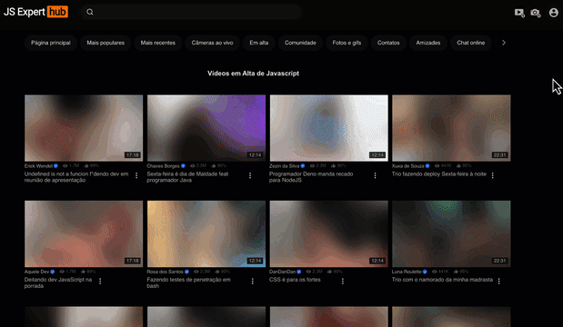

# JSExpertHub Reimaging Video Upload

## Preview

## Pre-reqs
- Este projeto foi criado usando Node.js v18.17.0
- O ideal é que você use o projeto em ambiente Unix (Linux). Se você estiver no Windows, é recomendado que use o [Windows Subsystem Linux](https://www.omgubuntu.co.uk/how-to-install-wsl2-on-windows-10) pois nas aulas são mostrados comandos Linux que possam não existir no Windows.

## Running
- Execute `npm ci` na pasta que contém o arquivo `package.json` para restaurar os pacotes
- Execute `npm start` e em seguida vá para o seu navegador em [http://localhost:3000](http://localhost:3000) para visualizar a página acima

## Checklist Features

- Video Uploader
  - [] - Deve entender videos em formato MP4 mesmo se não estiverem fragmentados
  - [] - Deve processar itens em threads isoladas com Web Workers
  - [] - Deve converter fragmentos de videos em formato `144p`
  - [] - Deve renderizar frames em tempo real em elemento canvas
  - [] - Deve gerar arquivos WebM a partir de fragmentos
  
  A unica coisa, é que o projeto não vai reiniciar quando voce alterar algum código, vai precisar dar um F5 na página toda vez que alterar algo

